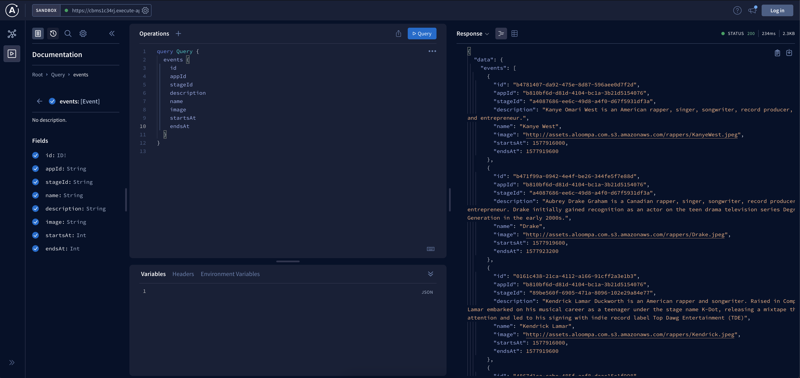

<br/>
<p align="center">
  <h3 align="center">Festival API</h3>

  <p align="center">
    A GraphQL API built on The Serverless Framework using Apollo Server and deployed via AWS
    <br/>
    <br/>
  </p>
</p>


## About The Project




I created this API for a take home project given by [Aloompa](https://aloompa.com/) and enjoyed every second of it. As you scroll down you'll find all the details you need to being playing around with it. Do know that there is no database integrated and it's only executing against a static JSON file. You will not see your mutations persist because of this. With that being said: enjoy!


## Built With

Node.js | Express | GraphQL | Apollo Server | Serverless | AWS

## Getting Started

If you'd like to take a gander at this API and play around with queries, mutations, and all the delights that GraphQL brings to the table just follow along below.

### Prerequisites

Before you go any further make sure you have the lastest version of Node installed on your machine by running: 

```sh
npm install npm@latest -g
```

Also go ahead and install serverless while you're at it if you'd like to deploy your own project in the future:

```sh
npm install -g serverless
```

### Installation

Now that you're all updated follow along below:

You can find a live demo of the API via [this link](https://cbms1c34rj.execute-api.us-east-1.amazonaws.com/dev/graphql) that allows you to make queries and mutations using Apollo's playground.

You can also fork and clone this repo to build on or use as scaffolding for your own API by:

1. Clone the repo

```sh
git clone https://github.com/brennankapollock/AWS-Aloompa-API
```

2. Install npm packages

```sh
npm install
```

3. Start local environment w/ serverless-offline

```sh
npm run start
```
4. You can now access the API locally at [http://localhost:3000/dev/graphql](http://localhost:3000/dev/graphql)   


## Usage

### Queries: 


##### To get all apps 

```
query getAllApps {
  apps {
    id
    name
  }
}

```

##### To get all stages
```
query getAllStages {
  stages {
    id
    name
  }
}
```

##### To get all events
```
query getAllEvents {
  events {
    id
    appId
    stageId
    description
    name
    image
    startsAt
    endsAt
  }
}

```
##### To get one stage by passing in a stage id(as a string type)
```
query getOneStage {
  stage(id: "a4087686-ee6c-49d8-a4f0-d67f5931df3a") {
    id
    name
  }
}
```
##### To get one event by passing in an event id(as a string type)
```
query getOneEvent {
  event(id: "b4781407-da92-475e-8d87-596aee0d7f2d") {
    id
    appId
    stageId
    name
    description
    image
    startsAt
    endsAt
  }
}

```
##### To get a stage via it's name
```
query getStageViaName {
  stageViaName(name: "Tizzle Stage") {
    id
    name
  }
}

```
##### To get an event via it's name
```
query getEventViaName {
  eventViaName(name: "Kanye West") {
    id
    appId
    stageId
    name
    description
    image
    startsAt
    endsAt
  }
}

```
##### To get all events happening at a stage via a stage id(as a string type)
```
query getEventsViaStageId {
  allEventsViaStage(id:"a4087686-ee6c-49d8-a4f0-d67f5931df3a") {
    name
    id
    appId
    stageId
    image
    description
    startsAt
    endsAt
  }
}

```
##### To get the stage a particular event is happening at via a stage id(as a string type)
```
query getStageInEvent {
  stageViaEvent(id: "a4087686-ee6c-49d8-a4f0-d67f5931df3a") {
    id
    name
  }
}
```
##### To get events that occur between to times(both arguments as string types)
```
query getEventViaTime {
  eventsViaTime(startsAt: "1577916000", endsAt: "1577919600") {
    id
    appId
    stageId
    description
    name
    image
    startsAt
    endsAt
  }
}

```

###Mutations: 

##### To add a stage by passing in a new stage name

```
mutation addStage {
  addStage(name: "Rattitude Stage") {
    id
    name
  }
}
```
##### To add an event by passing in all required fields that make an event type(times must be of integer type)
```
mutation addEvent {
  addEvent(name: "Andre-3000", description: "ATL's Greatest", image: "http://andre3000.com/headshot", startsAt: 1577916000, endsAt: 1577923200) {
    id
    appId
    stageId
    name
    description
    image
    startsAt
    endsAt
  }
}
```
##### To delete a stage by passing in the corresponding stage id(as a string type)
```
mutation deleteStage {
  deleteStage(id: "a6bb97dc-224c-4f8f-9af7-fd8b5731840f")
}
```
##### To delete an event by passing in the corresponding event id(as a string type)
```
mutation deleteEvent {
  deleteEvent(id: "d4cec773-c287-4efe-aca5-4274accb6656")
}
```
##### To update a stage by passing in the stage id and name(both as string types)
```
mutation  updateStage {
  updateStage(id: "a6bb97dc-224c-4f8f-9af7-fd8b5731840f", name: "Updated Stage"){
    id
    name
  }
}

```
##### To update an event by passing in the event id and desired fields to update
```
mutation updateEvent {
  updateEvent(id: "b4781407-da92-475e-8d87-596aee0d7f2d" name: "Ye", description: "He thinks of himself as god.") {
    id
    appId
    stageId
    name
    description
    image
    startsAt
    endsAt
  }
}
```

### If you have any questions please reach out! Hope you enjoy the API!


